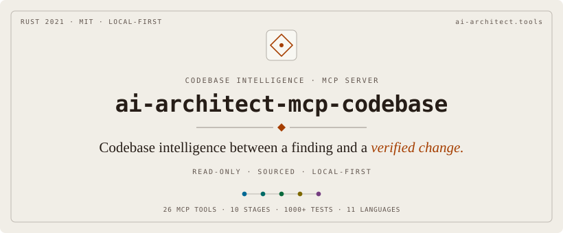

<!-- mcp-name: io.github.cdeust/ai-architect-mcp-codebase -->

<p align="center">
  
</p>

<p align="center">
  <a href="LICENSE"></a>
  
  
  
  
  <a href="https://www.bestpractices.dev/projects/13845"></a>
  
</p>

<p align="center">
  An MCP server that indexes a repository into a local code graph and answers
  structural questions about it: who calls this, what depends on it, what a
  diff touches, how execution reaches a function.
</p>

<p align="center">
  <a href="#what-it-is">What it is</a> ·
  <a href="#install-and-register">Install</a> ·
  <a href="#a-first-session">First session</a> ·
  <a href="#26-mcp-tools">Tools</a> ·
  <a href="#how-answers-state-their-limits">Limits</a> ·
  <a href="#development">Development</a>
</p>

---

## What it is

`ai-architect-mcp-codebase` parses a repository with tree-sitter, stores the
symbols and their relationships (definitions, calls, imports, implementations,
uses) in an embedded LadybugDB graph database on your machine, and exposes
that graph to an agent through MCP tools. An agent can search the graph, look
up a symbol with its callers and callees, list the reverse dependencies of a
symbol, follow execution flows from entry points, map a git diff onto the
symbols it changes, and compare two graphs of the same code. Answers about
symbols carry source locations and the limits of the analysis behind them.

The server does not edit the files it indexes. It writes its graph and
sidecar files under the `output_dir` you pass, plus a snapshot in the
repository only when you ask for the team-shared artifact. Indexing and queries
run locally without network calls, no language model reads the code, and
nothing is uploaded. The graph is a directory you own.

The graph comes from static parsing of source text, so some things stay out
of it. A call made through reflection, dynamic dispatch, generated code, or a
macro the parser does not expand has no edge unless an optional
language-server pass (`lsp: true`) or runtime traces (`ingest_traces`) supply
one. Method calls through a receiver are resolved statically only for the
receiver shapes listed [below](#static-receiver-call-resolution); the rest need
the language-server pass. Ruby gets a shallow extraction with no imports or
visibility. Process flows are reachability in the graph from declared entry
points, capped at depth 20, with no observation of execution. An empty answer
can mean "no such relationship" or "not indexed", and the coverage report
exists to tell those apart.

## Install and register

### Claude Code plugin

```bash
claude plugin marketplace add cdeust/ai-architect-mcp-codebase
claude plugin install ai-architect-mcp-codebase@ai-architect-mcp-codebase-marketplace
```

The plugin downloads the release binary and verifies its Sigstore provenance
before running it; this needs GitHub CLI 2.68 or newer. The plugin starts the
`full` profile unless `AP_PROFILE=core` is set.

### Other MCP hosts

```bash
cargo install ai-architect-mcp-codebase
ai-architect-mcp-codebase install          # writes the MCP entry for each detected host
```

`install` detects Claude Code, Codex CLI, Gemini CLI, Cursor, VS Code and Zed,
adds only its own entry to each config file, and never overwrites a file it
cannot parse. `--dry-run` previews the changes; `uninstall` removes them. To
configure a host by hand, register the binary as a stdio server:

```json
{
  "mcpServers": {
    "ai-architect": {
      "command": "ai-architect-mcp-codebase",
      "args": ["--profile", "core"]
    }
  }
}
```

[docs/install.md](docs/install.md) has the per-host snippets (Codex, Gemini,
Cursor, Windsurf, VS Code, the OpenAI Agents SDK), the optional Grep/Glob
hook, the plugin's release verification, and the developer escape hatch for
running a local build inside the plugin.

### Build from source

```bash
git clone https://github.com/cdeust/ai-architect-mcp-codebase.git
cd ai-architect-mcp-codebase
cargo build --release     # about five minutes the first time (LadybugDB's C++ core)
```

Rust 1.95.0 is pinned by [`rust-toolchain.toml`](rust-toolchain.toml), and
CMake is required.

### Tool profiles

The server registers one of two tool sets, chosen at startup with `--profile`
or the `AP_PROFILE` environment variable (the flag wins).

| Profile | Tools | Use |
|---|---|---|
| `core` | 8: `health_check`, `analyze_codebase`, `search_codebase`, `get_context`, `get_symbol`, `get_impact`, `query_graph`, `detect_changes` | Recommended for agents. Analyze once, then search, inspect and measure impact. |
| `full` | all 26 | Adds the manual graph passes, history, runtime traces, the verification tools, the artifact builder and the finding-record tools. |

```bash
ai-architect-mcp-codebase --profile core   # the 8 core tools
AP_PROFILE=core ai-architect-mcp-codebase  # same, through the environment
ai-architect-mcp-codebase                  # default: full (all 26)
```

The default stays `full` until the next major version, because shrinking the
default tool surface is a breaking change. New agent setups should use the
`core` profile (8 read-only tools): `analyze_codebase` already runs index,
resolve and cluster in one call, and leaving out the 18 hidden tools keeps the
tool prompt small.

## A first session

```
health_check()
  → server name and version, protocol version, registered tool count

analyze_codebase(path: "/path/to/repo", output_dir: "/tmp/repo-graph")
  → index, resolve, cluster and build the search index in one call
  → node and edge counts, communities, processes, and the coverage report

search_codebase(graph_path: "/tmp/repo-graph/graph", query: "tool request dispatch")
  → ranked symbols (BM25 and sparse TF-IDF fused with RRF), paged with next_offset

get_context(graph_path, qualified_name: "src/main.rs::handle_tool_call")
  → the symbol with its callers, callees, imports, implementations,
    community and processes; suggestions when the name does not match exactly

get_impact(graph_path, qualified_name: "src/main.rs::handle_tool_call")
  → callers, importers, users and implementors, the communities and processes
    affected, and an epistemic label (exact or lower-bound) with its reasons

detect_changes(graph_path, codebase_path: "/path/to/repo", base_ref: "main", head_ref: "HEAD")
  → symbols the diff adds, modifies or deletes, with a heuristic risk score each

query_graph(graph_path, graph: "missed")
  → the files the index could not fully cover, to check with grep
```

Re-run `analyze_codebase` after edits; indexing is incremental by default.

## 26 MCP Tools

Each tool takes JSON arguments checked against its JSON Schema and returns
structured JSON, with a named reason code on error. No tool calls a language
model. Agent installs rarely need all 26; the `core` profile registers just
the 8 code-intelligence tools.

```
Server:                  health_check
Index and resolve:       analyze_codebase · index_codebase · resolve_graph · lsp_resolve · cluster_graph · ingest_traces
Coverage:                index_status
Search and context:      search_codebase · get_symbol · get_context · query_graph
Impact and processes:    get_impact · get_processes · detect_changes
History:                 index_history
Verification:            check_security_gates · verify_semantic_diff · validate_prd_against_graph
Artifact export:         prepare_prd_input
Finding records:         extract_finding · refine_finding · start_verification · append_clarification · finalize_verification · abort_verification
```

| Tool | Core | What it does |
|---|:---:|---|
| `health_check` | yes | Returns server name and version, MCP protocol version and the registered tool count, which shows the active profile. |
| `analyze_codebase` | yes | Runs index, resolve and cluster in one call and builds the search index; `lsp: true` adds the language-server pass. Returns statistics and the coverage report. |
| `index_codebase` | | Walks and parses the repository into `<output_dir>/graph/`. Incremental by default; can export or import the [team-shared graph artifact](docs/configuration.md#team-shared-graph-artifact). |
| `resolve_graph` | | Adds cross-file `Imports`, `Calls`, `Implements`, `Extends` and `Uses` edges with confidence scores. |
| `lsp_resolve` | | Resolves remaining calls through rust-analyzer, pyright or typescript-language-server. |
| `cluster_graph` | | Detects communities (Louvain with C2 repair) and traces processes from entry points. |
| `ingest_traces` | | Folds runtime caller-to-callee observations (OTel spans, profiler or coverage traces) into the graph, and adds `OBSERVED_CALLS` edges where static resolution found none. |
| `index_status` | | Node and edge counts plus the coverage report. |
| `search_codebase` | yes | Hybrid ranked search over symbols, and BM25 search over documentation files. |
| `get_symbol` | yes | Exact lookup by qualified name with every incoming and outgoing edge; `sibling_graphs` looks for a definition in other repositories' graphs. |
| `get_context` | yes | One symbol with its relationships grouped by kind, its community and its processes. |
| `query_graph` | yes | Read-only Cypher, paged; `graph: "missed"` lists what the index did not cover. |
| `get_impact` | yes | Reverse dependencies of a symbol or file, with affected communities and processes and an epistemic label. |
| `get_processes` | | Lists execution flows with entry point, entry kind (`main`, `test`, `proof`, `handler`, `lib_entry`), depth and size. |
| `detect_changes` | yes | Maps a unified diff, or `base_ref`..`head_ref`, onto the symbols, communities and processes it touches. |
| `index_history` | | Adds git history as `Commit` and `Version` nodes linked to the files and symbols each commit changed. |
| `check_security_gates` | | Checks a list of changed symbols for auth-community touch, public-API change, unresolved imports and test-coverage gaps. |
| `verify_semantic_diff` | | Compares a before graph and an after graph: added and removed nodes and edges, dangling references, new unresolved imports, new cycles (Tarjan SCC), and a heuristic regression score. |
| `validate_prd_against_graph` | | Checks a product requirements document against the graph: symbols it names that do not exist, changes that span several communities, and "does not affect X" claims contradicted by process membership. |
| `prepare_prd_input` | | Writes a JSON bundle of graph facts (matched symbols, affected communities and processes, graph statistics) for a finding or a free-text feature description. |
| `extract_finding`, `refine_finding` | | Normalize an incoming finding to a canonical JSON record and store an agent's refinement of it. |
| `start_verification`, `append_clarification`, `finalize_verification`, `abort_verification` | | Record a question-and-answer clarification of a finding, finalized with a SHA-256 digest of the transcript. |

`validate_prd_against_graph`, `prepare_prd_input` and the finding-record tools
produce or check JSON artifacts on disk under the `output_dir` a call names. A specification tool such as
[ai-architect-mcp-spec](#related-projects), or any other consumer, can read
them; the server itself has no dependency on the consumer.

The verification verdicts have narrow meanings. `check_security_gates` returns
`gates_passed: true` when no check raised a critical flag, and
`report.assessment_complete` separately; the latter is false for an empty
symbol list, a skipped check, or changed symbols that could not be resolved.
The unsafe-symbol check is skipped until the Rust parser records `unsafe`.
Neither field certifies security. A `clean` verdict from
`verify_semantic_diff` needs a regression score below the threshold and no new
unresolved import, and says nothing about behavioural equivalence or
compilation; tests, the compiler or proofs establish those. A finalized
clarification digest binds the recorded transcript bytes and does not
establish that the finding is true.

## How answers state their limits

The read tools report what they could not see next to what they found. The
0.12.0 entry of the [CHANGELOG](CHANGELOG.md) has the detail for the coverage,
impact, language-server, receiver-resolution and freshness items below.

### Coverage report

`analyze_codebase`, `index_status` and `query_graph(graph: "missed")` report
files that were `parse_incomplete`, `skipped` or `quarantined`, plus three
Rust buckets added in 0.12.0. `outside_build_targets` lists indexed `.rs`
files outside every compiled Cargo target according to
`cargo metadata --no-deps` (a Kani proof file, an excluded `fuzz/` directory).
`feature_gated` lists modules reached only through a `mod` declaration whose
`#[cfg(feature = ...)]` is false under default features. `unlinked_file` lists
files rust-analyzer itself reports as belonging to no crate, recorded when an
LSP pass opens them. `cargo_attribution.status` says whether the two
Cargo-derived buckets were determined: `known`, `unknown` (the `cargo
metadata` call failed or `cargo` is missing, so an empty bucket means "not
determined"), `not_applicable`, or `not_recorded` for an older record.
`coverage.pruned_dirs` names every directory the walk skipped by policy, with
its reason. An empty coverage report is still not proof of completeness.

### Epistemic boundary on impact

`get_impact` labels its answer `exact` only when the coverage record has zero
gaps in every bucket, `cargo_attribution.status` is not `unknown`, and no
unresolved call site names the target. Otherwise the answer is `lower-bound`, with reasons.
`unresolved_callsites_naming_target` counts unresolved call sites whose callee
names the target, and `unresolved_callsites_outside_targets` counts those in
files outside the compiled Cargo targets, so an empty caller list can be told
apart from a symbol with no callers.

### Language-server pass

With `lsp: true`, `analyze_codebase` reports `lsp_status.state` as `disabled`,
`completed`, `completed_unresolved` (sites needed resolving and none were
resolved) or `failed`. A Rust crate nested under a Cargo workspace that does
not list it as a member fails the pass with `lsp_workspace_load_failed`, naming
the Cargo-level fix, before any resolution request is sent. Analysis continues
on the available graph when the pass fails. `server_health` carries the language
server's own last-reported health.

### Static receiver-call resolution

Since 0.12.0 the static resolver binds `self.m()` and `Self::m()` in Rust,
`self.m()` in Python and `this.m()` in TypeScript to the enclosing type's
method (`resolution_method: "receiver-type"`). In Rust it also binds `x.m()`
when `x` is bound once in the enclosing function by a typed parameter, a typed
`let`, or `let x = T::assoc(..)` (`"receiver-local-binding"`). It also
types `x` from the declared return type of a free function of the same file
that initialised it (`let x = make();`, and an `Option` or `Result` unwrapped by
`let Some(x) = .. else`, `.expect(..)`, `.unwrap()` or `?`), at a lower
confidence (`"receiver-return-type"`, 0.85). A receiver it cannot type is left
unresolved; it never falls back to a lookup by bare name.

### Query truncation and paging

`query_graph` bounds a query with no `LIMIT` of its own to 500 rows per page
(`limit_injected: true`). `truncated` is true whenever more rows exist after
the page, and `next_offset` reads the next one. When the row bound cut the
result, `total_count` is a lower bound. Paging is stable only when the query
declares `ORDER BY`, which `order_stable` reports. The tool's JSON Schema
description has the full contract.

### Freshness receipt

`search_codebase`, `get_symbol` and `get_impact` return `graph_freshness`
(`state: fresh | stale | unknown`, `dirty_files`, `checked_files`,
`commits_behind`, `commits_ahead`) on every response, errors included, so an
answer from a graph older than the working tree is marked as such. A graph
indexed by 0.11.x reads `unknown` until it is re-indexed.

## Languages

Rust, Python, TypeScript (and JavaScript through the TSX grammar), Java,
Kotlin, Swift, Objective-C, C, C++ and Go get deep extraction through a
per-language spec: definitions, calls and imports, plus visibility and type
relationships where the spec records them. Ruby is a shallow tier
([ADR-0056](docs/adr/ADR-0056-shallow-spec-language-breadth.md)): functions,
methods, classes and modules, and calls, with no visibility and no import
edges (`require` appears as a call). Other files, documentation and
configuration included, are indexed as `File` nodes. The text of documentation
files (`md`, `markdown`, `mdx`, `txt`, `rst`, `adoc`, up to 256 KiB) is
searchable through BM25. The language-server pass supports Rust, Python and TypeScript.

## Security model

The server enforces read-only access to the graph in `query_graph` with two
layers. The engine's compiled-plan check refuses database writes, and a
lexical gate refuses the filesystem statements the engine classifies as
read-only (`COPY … TO`, `EXPORT DATABASE`, `ATTACH`, and others), plus every
`CALL` outside a two-procedure allowlist. Git refs are validated, the
language-server command is limited to four known binaries, the walk has size
and depth limits, and parsing has a per-file deadline. Release binaries carry
Sigstore provenance that the Claude Code plugin verifies before running them.

[docs/security.md](docs/security.md) has the full list and the analysis of
why both `query_graph` layers are needed, and
[docs/ASSURANCE-CASE.md](docs/ASSURANCE-CASE.md) the security argument.
Report vulnerabilities through [SECURITY.md](SECURITY.md).

## Green software engineering

The dominant energy cost in an LLM-assisted coding workflow is the model
inference spent re-reading files to answer a question a structural query could
answer once; this binary's CPU is small next to it. Every token an agent does
not process is compute that is never scheduled. The
[Green Software Foundation](https://greensoftware.foundation/) calls this
energy proportionality, and here it is applied where the constant is largest.

The head-to-head evaluation measures that demand under a pre-registered
protocol, n=20, reproducible offline with no API key:

| Demand term | Graph tools | Grep/Glob/Read baseline | Reduction |
|---|---:|---:|---:|
| Payload token proxy | 43.14 ± 17.26 | 550.36 ± 330.28 | 14.26x (mean of per-question ratios) |
| Modeled tool calls | 1.00 ± 0.00 | 5.20 ± 1.64 | 5.20x |

Costs are modeled. Both legs use a payload-size / 4 token proxy, and indexing,
client prompts, real MCP response envelopes and model reasoning are excluded.
The corpus informed fixes #87 and #92, so this is a regression benchmark.
Dividing aggregate payload volumes gives 12.76x, a different statistic. No
energy or CO2 figure is derived from these numbers, because this repository
measures no joules and a token count does not convert to watt-hours.
[docs/evaluation.md](docs/evaluation.md#graph-tools-compared-with-a-grepglobread-baseline)
has the full table, the protocol and the falsified first run.

On the server side, bulk graph writes through UNWIND with a typed struct cost
0.127 ms per edge against 9.658 ms for the naive raw-string path, 76 times
less work for the same output (measured 2026-07-28 on `lbug 0.18` with
`tests/lbug_bulk_investigation.rs`). Tree-sitter extracts structure without a
model, and indexing is incremental by default. The server-side measurements
and their dates are in [docs/evaluation.md](docs/evaluation.md).

## The zetetic standard

Inherited from
[zetetic-team-subagents](https://github.com/cdeust/zetetic-team-subagents).

| Pillar | Question |
|---|---|
| Logical | Is it consistent? |
| Critical | Is it true? |
| Rational | Is it useful? |
| Essential | Is it necessary? |

In this codebase:

1. Every algorithm traces to a source. Louvain: Blondel et al. 2008. Leiden
   C2 repair: Traag et al. 2019. RRF: Cormack, Clarke and Büttcher 2009.
   Strongly connected components: Tarjan 1972. BM25 (through Tantivy):
   Robertson et al. 1994.
2. Named constants record their source or measured rationale. The RRF
   constant `K = 60.0` in `src/search/rrf.rs` cites Cormack 2009;
   `BULK_BATCH_SIZE = 500` cites LadybugDB practitioner guidance and the April
   2026 scalability audit. [CONTRIBUTING.md](CONTRIBUTING.md) requires a
   `// source:` annotation on every numeric constant with three or more
   significant digits, and an efficiency claim with no measurement behind it
   does not ship.
3. No invented numbers. Where a value was chosen by judgment, the comment
   says so and gives its operational justification.
4. Error responses name the rule that was violated, for example
   `unsafe finding_id (spec §5.1.4, §9.3 Q4): must not contain '..'`.
5. When a capability is unavailable, the tool says so in plain language. For
   example, `lsp_resolve` on a binary that is not a language server returns
   `lsp_probe_failed: found on PATH but didn't respond as an LSP server
   (stdout closed immediately; likely a stub, proxy, or non-LSP binary)`.

## Development

```bash
cargo build --release
cargo test                                            # full suite (2500+ tests)
cargo test --test graph_accuracy                      # structural accuracy gate
cargo clippy --all-targets -- -D warnings             # zero warnings, enforced in CI
python3 scripts/check_doc_claims.py                   # README numbers against their sources
```

CI also measures line coverage with `cargo llvm-cov` (80% floor) and checks the
coverage and test-count badges above against that run. Contributions need a
DCO sign-off (`git commit -s`); [CONTRIBUTING.md](CONTRIBUTING.md) has the
layer rules and coding standards, and
[docs/architecture.md](docs/architecture.md) the module map, dependencies and
design records. The evaluation programs are described in
[docs/evaluation.md](docs/evaluation.md).

## Repository layout

```
ai-architect-mcp-codebase/
├── src/
│   ├── main.rs                    ← MCP server entry point and dispatch
│   ├── tool_schemas.rs            ← JSON Schemas, one file per tool group
│   ├── tool_profile.rs            ← core and full profiles
│   ├── graph_store/               ← LadybugDB port
│   ├── parser/                    ← tree-sitter extraction, one spec per language
│   ├── indexer/                   ← walk, parse, persist, coverage
│   ├── resolver/                  ← cross-file resolution
│   ├── lsp_client/ · lsp_resolver/
│   ├── clustering/                ← communities, processes, impact
│   ├── search/                    ← BM25, sparse TF-IDF, RRF
│   ├── history/                   ← git history layer
│   ├── prd_input/ · prd_validator/ · security_gates/
│   └── semantic_diff.rs · git_diff.rs
├── tests/                         ← integration tests and graph_accuracy.rs
├── benchmarks/                    ← eval_headtohead, token_surface, incremental_speed
├── stages/                        ← design specs and decision records
├── docs/                          ← install, configuration, security, architecture, evaluation
├── scripts/                       ← doc-claim and pin gates
├── bin/                           ← plugin launcher and release verification
├── skills/                        ← host-native workflows
├── plugins/                       ← Codex plugin package
├── mcp-contract.json
└── Cargo.toml
```

## Status

Version 0.13.0. The capabilities above are covered by the test suite and the
accuracy gate in CI and have been run end to end on the maintainer's machine;
they have not yet been validated in a production deployment. The unsafe-symbol
security check waits on `unsafe` extraction in the Rust parser. Rename and
refactor tools are out of scope because the server does not edit code. Direction is in
[docs/ROADMAP.md](docs/ROADMAP.md); what shipped is in
[CHANGELOG.md](CHANGELOG.md).

## Related projects

Each of these runs on its own. [Cortex](https://github.com/cdeust/Cortex) is
a persistent-memory MCP server, and
[ai-architect-mcp-spec](https://github.com/cdeust/ai-architect-mcp-spec) is an
MCP server for PRD generation and specification verification. An agent that
has both this server and ai-architect-mcp-spec registered can ground a
specification in the graph through `search_codebase`, `get_context` and
`get_impact`, or through the JSON file `prepare_prd_input` writes, and check
the result with `validate_prd_against_graph`.

## License

MIT, see [LICENSE](LICENSE). Published on crates.io as
[`ai-architect-mcp-codebase`](https://crates.io/crates/ai-architect-mcp-codebase)
and listed in the [MCP Registry](https://registry.modelcontextprotocol.io)
under the name below.

mcp-name: io.github.cdeust/ai-architect-mcp-codebase

This software is the independent work of Clément Deust. It was developed
outside any employment relationship and is not affiliated with, endorsed by,
or owned by any past or present employer.

The graph and retrieval algorithms used here (Louvain community detection with
C2 repair, BM25, RRF rank fusion, tree-sitter parsing, Tarjan strongly
connected components) come from published research; citations are inline in
`// source:` annotations and in `docs/`. The MIT license covers this
implementation and asserts no ownership over the underlying algorithms, which
remain attributable to their original authors.
